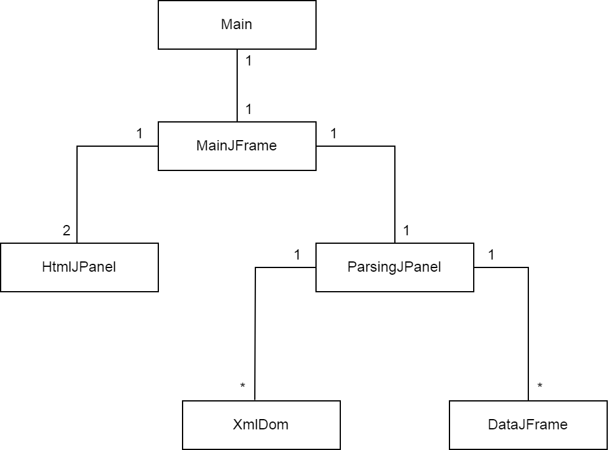

# XML-parser Harjoitustyö

## Linkit

* Sovelluksen tila: [weeklyUpdates:](https://github.com/Zessi19/XML-parser/tree/main/documentation/weeklyUpdates.md)
* Käyttöopas: (myöhemmin)

## Sovelluksen kuvaus

Harjoitustyön tavoitteena on luoda yksinkertainen XML parserointi ohjelma, jota käytetään graafisen käyttöliittymän kautta. Projekti koodataan Javalla ja GUI rakennetaan Javan AWT ja Swing frameworkkejä apuna käyttäen.

Käynnistettäessä ohjelma avaa valittujen tiedostojen perusnäkymän (aluksi tyhjä). Ohjelma menubaarissa on kaksi aukeavaa valikkoa "Files" ja "Help". Valikon Files kautta käyttäjälle aukeaa kolme toimintoa: "Show All", "Add New" ja "Remove All". Show All palauttaa käyttäjän valittujen tiedostojen perusnäkymään. Add New avulla käyttäjä voi etsiä uuden tiedoston levyltä, joka lisätään tiedostojen perusnäkymään. Remove All poistaa kaikki käyttäjän valitsemat tiedostot.

Help valikon kautta käyttäjälle aukeaa kaksi näkymää: "User Guide" ja "Keybinds". User Guide vaihtaa näytettäväksi appData kansion guide.html tiedoston, jossa on esitetty ohjelman tiivistetyt käyttöohjeet. Vastaavasti Keybinds vaihtaa näytettäväksi saman kansion keybinds.html tiedoston, jossa näytetään ohjelma näppäimistön "shortcutit".

Kun käyttäjä valtsee levyltä tiedoston, tiedosto ilmestyy tiedostojen perusnäkymään. Jokaisen tiedoston vieressä on "radio button" ja tiedostoa klikkaamalla XML dokumentti aukeaa uuteen ikkunaan. Jokaisella tiedostolla on myös painike, jolla pelkästään kyseinen tiedosto voidaan poistaa tiedostolistasta. Kun käyttäjä painaa "Run parser" nappia, ohjelma suorittaa valitun tiedoston parsinnan ja näyttää Credit/Debit summan käyttäjälle (total sum sekä summat kuukausittain eriteltynä). Parseroinnin tulos esitetään joko uudessa ikkunassa tai sisällyttää tiedostojen perusnäkymään (päätetään myöhemmin).

(Tarkka selvitys XML tiedoston parsinnasta lisätään tähän viikolla 6. tai viikolla 7.)

## Luokkakaavio

* **Main:** Käynnistää ohjelman
* **MainJFrame:** Sovelluksen pääikkuna ja menubar
* **HtmlJPanel:** HTML-tiedosto näyttäminen, esim. Help -> User Guide
* **ParsingJPanel:** Sovelluksen päänäkymä: tiedostojen avaaminen, parsinnan käskytys, valitun tiedoston poisto
* **XmlDom** Parsii XML-tiedoston DOM objektiksi, sisältää parsinta metodit, output HTML Stringinä
* **DataJFrane** Parametrina annetun datan näyttäminen uudessa ikkunassa (Java File object tai HTML String)

## ~~Avoimet kysymykset~~

* **Edit: DOM (org.w3c.dom) OK!**
  - Suunnitelma on käyttää Javan kirjastoista löytyvää DOM parseria, kun data luetaan XML-tiedostosta. DOM parser lukee datan puu-tyyppiseen tietorakenteeseen ja mahdollistaa datan monipuolisemman käsittelyn ja parsinnan. DOM parserin käyttö voi aiheuttaa isommilla data määrillä pullonkaulan muistin käytössä, mutta projektin tapauksessa tämä ei ole ongelma. 

  - Jos DOM parserin käyttö ei jostain syystä onnistu, pystytään projektin vaatimat summat ja kuukausisummat laskea myös yksinkertisesti lukemalla tiedostoa riviviltä ja laskemalla kumulatiivista summaa riveittäin "rivi Stringiä" kirjain kirjaimelta läpikäymällä O(n) ajassa. Tällöin parsinta kannattaa suorittaa kerran tiedoston avaamisen yhteydessä ja tulokset säilötään muistiin uusinta kyselyjen varalle. Toki tämä on erittäin huonosti skaalautuva tyyli, kun XML schema monimutkaistuu, erilaisten kyselyiden määrä kasvaa, tai XML tiedostoon pitäisi lisätä dataa tai muokata sitä.

* **Edit: Ei muodostu ongelmaa tässä projektissa**
  - Tällä hetkellä menubarin kolme näkymää (JPanel) lisätään käynnistämisen yhteydessä soveulluksen main frameen (JFrame). Kun näkymää vaihdetaan, näytettävä paneeli muutetaan näkyväksi ja loput piilotetaan. Jos vaihdettavien näkymien tarvitsema muisti kasvaa, olisi varmaankin parempi että HTML paneelit ladattaisiin vasta, kun ne halutaan nähdä ja vapautettaisiin näkymää vaihdettaessa. Projektin mittakaavassa tämä tuskin on ongelma, mutta voin testata tätä ajan salliessa projektin lopussa.

## Aikatalu

* **Week 5.:** ~~Java AWT/Swing tutustuminen, GUI runko, Suunnitelma~~ OK
* **Week 6.:** ~~XML tiedoston valitseminen levyltä ja valinnan poisto, Tärkeimmät parserointi toiminnallisuudet, XML tiedoston näyttäminen GUI:ssa~~ OK
* **Week 7.:** Puuttuvat lisätoiminnallisuudet, koodin refaktorointi ja kommentointi
* **Week 8.:** Hienosäätö, Demo
* **Week 9.:** Tarvittaessa
